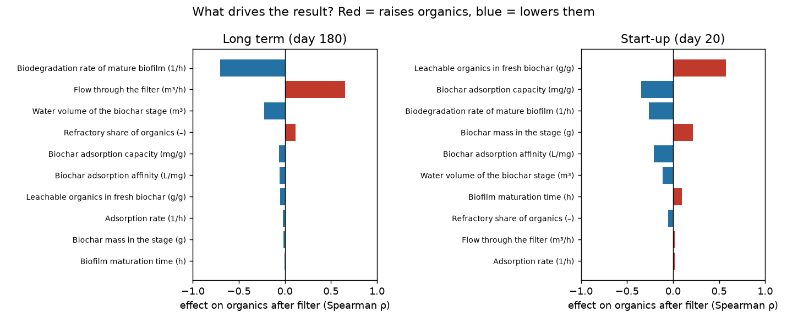

# Field plan — new pilot site (Tabanan)

*Based on a global sensitivity analysis of model v2 (400 Monte Carlo runs, all uncertain inputs varied over realistic ranges; computed with the legacy Python mirror `python/sensitivity_v2.py` — to be re-run in Julia before these numbers are used in the grant application).*

## What the analysis says

With today's knowledge the model predicts organics after the filter of **14.8 mg/L (median), 90% range 8.8–16.2**. Only **8% of plausible systems** reach the 10 mg/L limit. The uncertainty is dominated by very few inputs:

**Long term (after the biofilm has matured):**
1. **Biodegradation rate of the biofilm** — the single biggest driver (ρ = −0.70).
2. **Flow through the filter** — almost as big (ρ = +0.65). More flow = shorter contact = worse.
3. Volume of the biochar stage (ρ = −0.22).
4. Everything about biochar adsorption (capacity, affinity, rate, mass) matters **very little** in the long run (|ρ| ≤ 0.06) — the char saturates, biology does the work.

**Start-up (first weeks):**
1. **Organics leaching from fresh biochar** (ρ = +0.58) — this is what the Udayana "after" sample most likely shows.
2. Biochar adsorption capacity (ρ = −0.35).
3. More biochar *raises* start-up organics if it is not rinsed (ρ = +0.21).

**Design message:** control **flow / contact time** and grow a healthy **biofilm**; **rinse and charge** the biochar before installing. Adding more biochar alone will not fix dissolved organics.

## What to measure — in priority order

| # | Measure | Why (model input) | How | When |
|---|---|---|---|---|
| 1 | **Flow through the filter** | 2nd biggest driver | bucket-and-stopwatch at the outlet, or float method in the channel; 3× per visit | every visit |
| 2 | **Weekly in/out samples**: KMnO4 (or COD), turbidity, nitrate, phosphate, pH, temperature | gives the biofilm rate — the biggest driver | outlet sampled ~one residence time after the inlet sample; same lab (Udayana) | weekly, 6–8 weeks from installation |
| 3 | **Stage dimensions** | contact time | length × width × water depth of each stage; estimate porosity of the media | first visit |
| 4 | **Biochar rinse test** | start-up leaching | soak 1 kg biochar in 10 L canal water 24 h, measure KMnO4 of the water vs. canal water | before installation |
| 5 | **E. coli / coliforms** in and out | main project target, not in the Udayana test | same lab, same days as #2 | at least weeks 0, 2, 4, 8 |
| 6 | Biochar jar test (3 doses, samples at 1/4/24 h) | adsorption parameters | lab or simple bottles | once — low priority (small effect) |
| 7 | Inflow BOD5 vs COD | refractory share | lab | once |

**Minimum for the weekend visit:** #1 flow (3 readings), #3 dimensions + photos, and agree who takes the weekly samples (#2, #5).

## What we get back
With #1–#3 the model gives a **site-specific** contact time and bed size instead of a generic "~16 h". With 6–8 weeks of #2 it becomes a calibrated tool with honest confidence ranges — the basis of the decision-support tool for the EbA Fund application.
