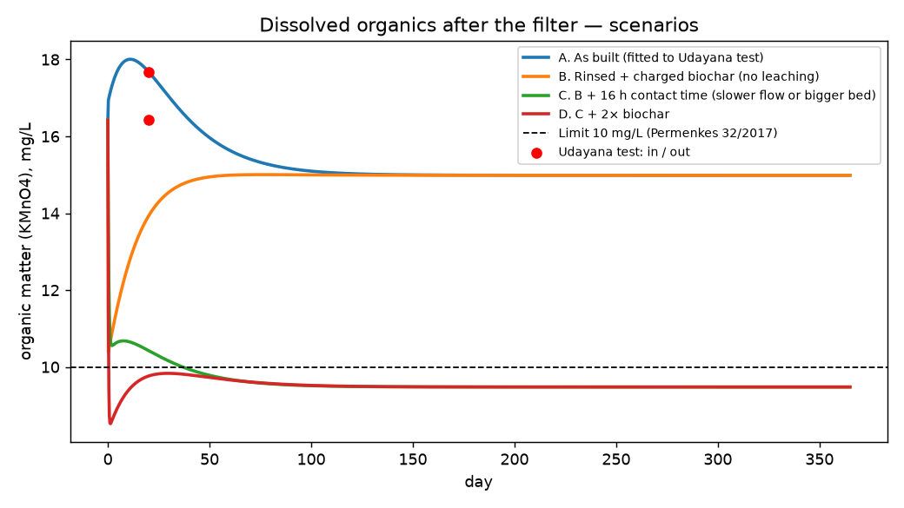
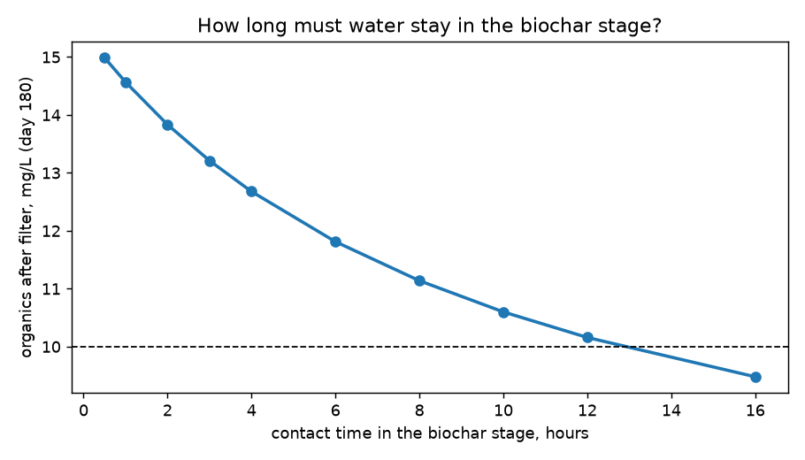
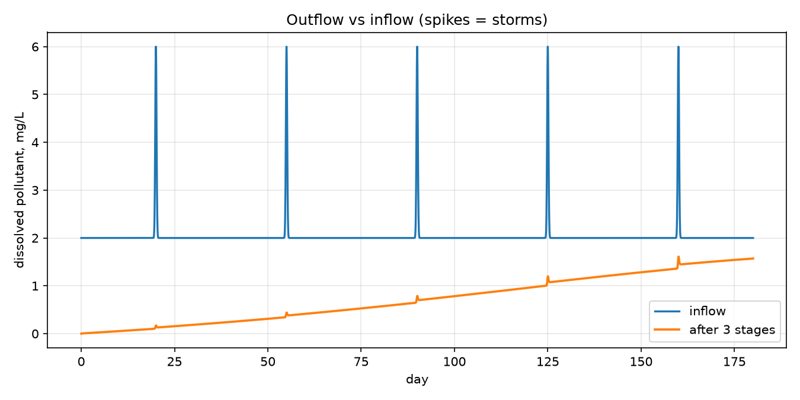
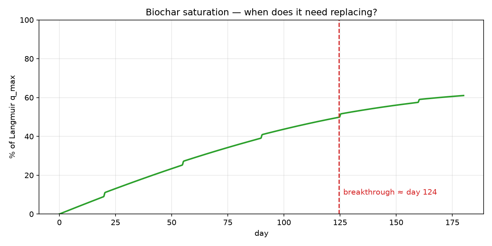
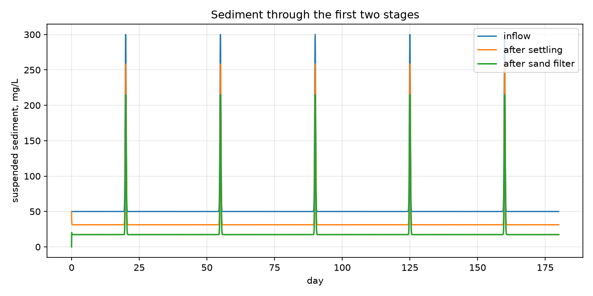
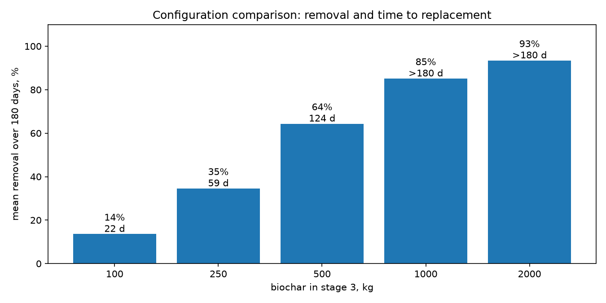

# Model v2 — calibrated on your water tests (Udayana, 16 Aug 2026)

**What the tests show**

| | before | after | change | limit |
|---|---|---|---|---|
| Turbidity, NTU | 3.77 | 1.78 | **−53%** | 25 |
| Organic matter (KMnO4), mg/L | **16.42** | **17.68** | **+8%** | **10** |
| Nitrate-N, mg/L | 0.943 | 0.999 | +6% | 10 |
| TDS, mg/L | 164.1 | 163.5 | ≈0 | 1000 |
| Heavy metals | below detection | below detection | | |

The filter works well **mechanically** (particles, turbidity). **Dissolved organics are not removed** — they even rise slightly — and organic matter is the **only parameter above the limit**. So v2 models the two separately:

* **particles:** capture in every stage, calibrated to the measured −53%;
* **dissolved organics:** adsorption on biochar (Langmuir), a biofilm that matures over ~3 weeks, **leaching from fresh biochar**, and a refractory share.



| Scenario | organics day 20 | organics day 180 | turbidity day 180 |
|---|---|---|---|
| A. As built (fitted to your test) | 17.7 | 15.0 | 1.78 |
| B. Rinsed + charged biochar | 13.9 | 15.0 | 1.78 |
| C. B + 16 h contact time | 10.4 | **9.5** | 0.40 |
| D. C + 2× biochar | 9.8 | 9.5 | 0.40 |



**What it suggests (to be tested):**
1. **Rinse and charge the biochar before installing** — fresh char releases organics in the first weeks (explains the +8%).
2. **Contact time, not biochar mass, is the lever.** With ~0.5 h in the biochar stage the biofilm has no time to work; the model needs **~16 h** to bring organics under 10 mg/L. Options: slower flow through a side channel, a bigger/deeper bed, or recirculation (easy in ponds / oyster tanks).
3. Doubling biochar helps only in the first weeks — adsorption saturates, biology does the long-term work.

**Limits, honestly:** one before/after pair taken at the same moment cannot identify kinetics. Flow, stage volumes and biochar properties are placeholders. Scenario A is fitted, B–D are hypotheses.

**Data to collect at the new pilot (Tabanan) to turn this into a validated tool:**
* flow rate (m³/h) and water volume of each stage;
* biochar mass, particle size, feedstock, rinsed/charged or not;
* samples **in and out at the same water parcel** (out sampled one residence time later), **weekly for 6–8 weeks** from installation: KMnO4/COD, turbidity, nitrate, phosphate, pH, temperature;
* one storm event sampled if possible.

Verified: Julia 1.13.1 and the Python mirror give identical results (table above).

Run: `python3 python/run_v2.py` (Python mirror) or `GKSwstype=100 julia --project=. scripts/run_v2.jl`.

---

# Subak ecofiltration — first dynamic model (draft)

A first-pass computational model of a three-stage, nature-based filtration
train for Subak irrigation water in Bali:

```
inflow → [1] settling basin → [2] sand/gravel filter → [3] biochar bed → outflow
```

It is a **starting point for discussion**, built to show how the physical
system could be translated into a calibratable model. All parameter values are
**illustrative placeholders**, not measurements — the next step is to replace
them with lab and field data.

## What the model represents

Each stage is a well-mixed reactor (tanks-in-series), which keeps the number of
parameters small enough to calibrate against sparse early field data. A
spatially resolved (advection–dispersion PDE) version of the biochar bed is a
natural second step once breakthrough curves are measured.

| Process | Form |
|---|---|
| Flow & residence time | inflow Q(t) with storm pulses; residence time V/Q per stage |
| Sedimentation | first-order, `k_settle = v_s / h` |
| Filtration of particles | first-order straining, `k_filter` |
| Biological degradation | first-order biofilm decay per stage, `k_bio,i` |
| Adsorption onto biochar | linear-driving-force kinetics towards a Langmuir isotherm, `q_eq = q_max·K·C/(1+K·C)` |
| Media saturation | biochar loading `q(t)` tracked explicitly; breakthrough detected |
| Storm / high-flow events | flow ×4, sediment ×6, dissolved load ×3 (first flush), Gaussian pulses |

State variables: suspended solids and dissolved pollutant in stages 1–2,
dissolved pollutant in stage 3, and pollutant loading on the biochar.

## First results (illustrative parameters)







Configuration comparison — biochar mass in stage 3 vs mean removal over 180 days
and day of breakthrough (outflow above 50 % of the inflow baseline):

| Biochar, kg | Mean removal, % | Breakthrough |
|---|---|---|
| 100 | 14 | day 22 |
| 250 | 35 | day 59 |
| 500 | 64 | day 124 |
| 1000 | 85 | > 180 days |
| 2000 | 93 | > 180 days |



This is the kind of question the model is meant to answer with real data: *how
much media, in which order, replaced how often, for a target removal under
tropical flow?*

## Run it

Julia (main model, DifferentialEquations.jl with a stiff `Rodas5P` solver):

```bash
julia --project=. -e 'using Pkg; Pkg.instantiate()'
julia --project=. scripts/run_demo.jl
```

`python/mirror.py` is a line-by-line SciPy mirror of the same equations and
defaults, used to cross-check the Julia model; the figures above were rendered
with it.

## What would make it real

1. The field setup: stage volumes, media masses, flow rates, hydraulic paths.
2. Target pollutants (e.g. phosphate, nitrate, TSS, pesticides) — one state per pollutant.
3. Lab isotherms and batch kinetics for the actual biochar (q_max, K, k_ads).
4. Inflow time series and rainfall; outflow measurements for calibration.
5. Then: parameter estimation, global sensitivity analysis, and a PDE model of the biochar column.

## Next steps

- Separate pollutants (N, P, organics) and add nutrient uptake in the ecological polishing stage.
- Replace the biochar CSTR by a 1-D advection–dispersion–adsorption column (method of lines).
- Calibrate against the first field measurements; rank parameters by sensitivity.
- Compare modular configurations under a rainfall record for Bali.

— Max Igoshev
